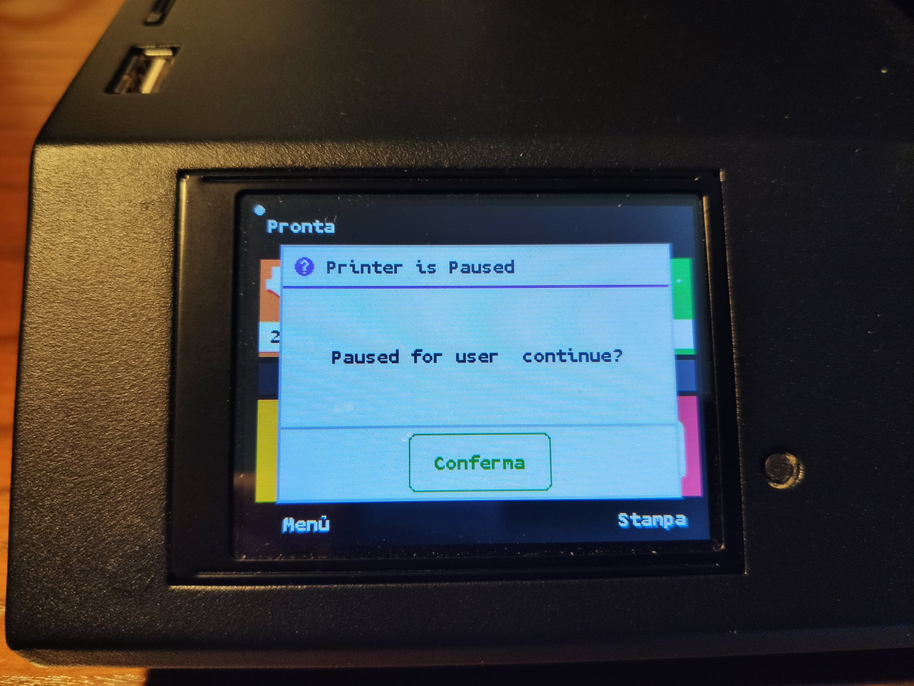
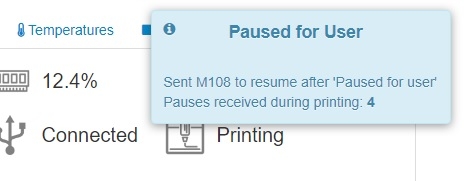

# OctoPrint-IgnorePausedForUser

## Introduction

Octoprint plugin to ignore 'Paused for User' message from printer.  

Occasionally when printing from Octoprint the printer stuck with the message "Paused for user".  
This plugin when receives that message from the printer, sends an M108 to resume printing immediately.  
Obviously it should not be used if one or more filament changes are planned.  

  

### Settings

* Enable/Disabled  
To enable/disable the M108 response  

* Autoclose  
To auto-hide pop-up after a delay  

* HistorySize  
How many records in History

### Changelog

* Version 1.2.0 19/02/2021  
Count the pauses skipped during a print  
Specific log file  
History data  

* Version 1.1.6 29/01/2021  
Improved the UI of settings page

* Version 1.1.5 25/01/2021  
First release
